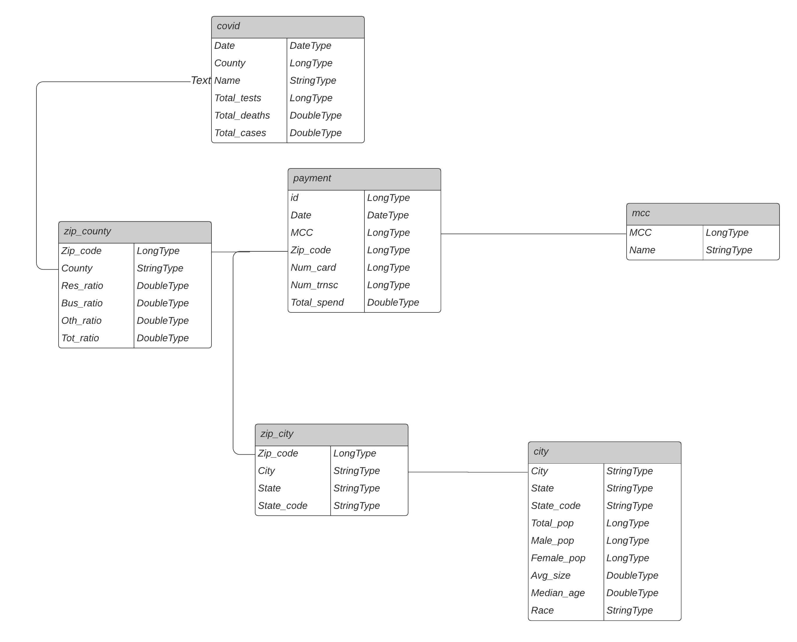

# Facteus Data Lake

> The project helps Facteus to build a data lake hosted on AWS S3 to understand how COVID-19 affects payments transactions.
I built an ETL pipeline to extract raw data from S3, process them using Spark, and transform into dimension tables for analytic purposes.

## Table of contents
* [Setup](#setup)
* [Data Lake](#data-lake)
* [ETL Pipeline](#etl-pipeline)
* [Instructions](#instructions)
* [Project Write Up](#write-up)
* [License](#License)

## Setup
* Facteus Data Lake.ipynb is the JupyterNotebook that documents the steps and results of building the data lake.
* dwh.cfg contains credentials configuration to connect to AWS account.

## Data Lake
* The project builds an ETL pipeline to move millions of payment transaction records after COVID-19 outbreak, COVID cases tracking data and other demographic datasets to a data lake hosted on S3. 
* The data lake can generate insights of how the pandemic change people's payment behavior, how business sectors are affected, and how different demographic and geographic groups react to the pandemic. 

### Datasets
* **Daily Spending Data**: The dataset comes from Facteus, a provider of financial data business intelligence. It covers payments transactions from 2020/04/17 to 2020/07/07, including payment date, merchant information, card holder zip code and payment details.
* **Covid County Data**: It is open sourced data tracking daily total Covid-19 tests, cases and deaths by county.
* **U.S. City Demographic Data**  This data comes from US Census Bureau's 2015 American Community Survey. It includes household details in the cities.
* **Zip_City Data**: The data comes from Simplemaps. It connects Zip Code with city and county.
* **ZIP Code Crosswalk Data**: The data comes from HUD’s Office of Policy Development and Research. It relates ZIP codes to county FIPS, including county composition details.
* **Merchant Category Code Data** The data comes from Visa Merchant Data Standards Manual. It relates merchant category codes to merchant names.

### Data Model
* The data lake is built on the snowflake schema. 
* The centralized fact table is the payment table.
* The snowflake schema normalizes dimensions into multiple related tables since each dimension (covid, city demographics) contain more data than a single dimension table. 
* It also decreases the space to store the data and the number of places where it needs to be updated if the data changes.

The ER diagram is shown below

## ETL Pipeline

ETL Pipeline is built to 
+ extract data from a directory of Facteus payments transactions, COVID tracking data, etc. residing on AWS S3 
+ process the data into Spark DataFrames using Apache Spark.
+ transforms Spark DataFrame into analytics tables in parquet format back to S3.

### Data Cleaning

* Use dropna() to handle rows with null values.
* Use dropDuplicates() to handles duplicate records where appropriate.

## Instructions

* Fill in credentials.cfg AWS_ACCESS_KEY_ID and AWS_SECRET_ACCESS_KEY.
* Run Facteus Data Lake.ipynb to run the ETL pipeline.

## 5. Project Write Up
**1. Why Data Lake?**
* The key data is payments transactions. But what insights we want to drive is undefined. I add covid data into the data lake to examine how covid change people's consumption pattern. We can also put other data into data lake to drive other insights.

**2. Why PySpark?**
* Spark is much faster than Hadoop for large scale data processing and more user friendly.

**3. How often the data should be updated?**
* The data should be updated weekly. Allow a week for consumption pattern changes.

**4. What if the data was increased by 100x?**
* Spark can handle it with its better scalability and overall faster runtimes.

**5. What if the data populates a dashboard that must be updated on a daily basis by 7am every day?**
* Update the tables stored in the data lake daily using Append or Overwrite Mode by spark.write

**6. What if the database needed to be accessed by 100+ people?**
* The more people accessing the database the more CPU resources we need to get a fast experience. By using a distributed database we can improve the replications and partitioning to get faster query results for each user.

**Subscription rate is higher for female in the sample**
## License
The project is released under the MIT License.
